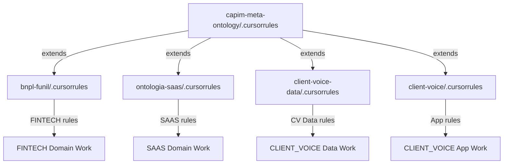

# Workspace Structure - Capim Ecosystem

> **Purpose**: Standardized organization and naming conventions across all projects  
> **Last Updated**: 2026-02-03  
> **Version**: 2.0 (Standardized Hierarchy)

---

## Overview

The Capim workspace is organized as a **federated multi-domain system** with:
- **1 Meta-layer** (capim-meta-ontology): Federation, routing, skills, global rules
- **3 Ontology projects** (bnpl-funil, ontologia-saas, client-voice-data): Domain knowledge
- **1 Application project** (client-voice): Presentation layer

---

## Project Types & Conventions

### Type 1: Meta-Ontology (Federation Layer)

**Project**: `capim-meta-ontology/`

**Purpose**: Router, validator, and orchestrator for cross-domain reasoning

**Standard structure**:
```
capim-meta-ontology/
├── .cursor/
│   ├── rules/                   # Behavioral protocols (auto-applied)
│   │   ├── memory_governance.mdc
│   │   ├── snowflake_data.mdc
│   │   └── ontology_reasoning.mdc
│   └── skills/                  # Invocable workflows
│       ├── session-start/
│       ├── session-end/
│       └── ...
├── _memory/                     # Decision tracking and session notes
│   ├── DECISIONS_IN_PROGRESS.md
│   ├── LESSONS_LEARNED.md
│   └── SESSION_NOTES/
├── _ontology/                   # Global ontology definitions
│   ├── TAXONOMY.yaml
│   ├── AXIOMS.yaml
│   └── INFERENCE_RULES.yaml
├── _federation/                 # Cross-domain integration
│   ├── DOMAIN_REGISTRY.yaml
│   ├── CAPABILITY_MATRIX.yaml
│   └── CROSS_DOMAIN_GLUE.yaml
├── docs/                        # Shared documentation
│   ├── VISUALIZATION_STANDARDS.md
│   ├── WORKSPACE_STRUCTURE.md (this file)
│   └── ANTIGRAVITY_TO_CURSOR_MIGRATION.md
├── .cursorrules                 # GLOBAL cursorrules (extended by projects)
└── START_HERE_ECOSYSTEM.md
```

**Key Files**:
- `.cursorrules` — Global rules for all projects
- `.cursor/rules/` — Auto-applied behavioral protocols
- `.cursor/skills/` — Invocable workflows (@session-start, @debate, etc.)
- `_memory/` — Decision tracking and history
- `docs/` — Shared documentation (VISUALIZATION_STANDARDS, etc.)

---

### Type 2: Ontology Projects (Domain Knowledge)

**Projects**:
- `bnpl-funil/` (FINTECH domain)
- `ontologia-saas/` (SAAS domain)
- `client-voice-data/` (CLIENT_VOICE domain)

**Purpose**: Domain-specific data models, queries, and semantic documentation

**Standard structure**:
```
<ontology-project>/
├── _domain/                     # Ontology layer
│   ├── _docs/
│   │   ├── ENTITY_INDEX.yaml           # Entity catalog
│   │   ├── ONTOLOGY_INDEX_<DOMAIN>.yaml
│   │   └── reference/
│   │       └── *_SEMANTIC.md           # Semantic docs (curated)
│   ├── _governance/
│   │   └── MEMORY_ARCHITECTURE_CONSTITUTION.md (link to meta)
│   └── START_HERE.md                   # Domain entry point
├── docs/                        # Data dictionaries and references
│   ├── reference/
│   │   └── *.md                        # Technical profiling
│   ├── adr/                            # Architecture Decision Records
│   ├── enrichment/                     # Enrichment documentation
│   ├── studies/                        # Analysis findings
│   └── START_HERE.md                   # Operational guide
├── queries/
│   ├── origin/                         # Canonical queries (mirrors source)
│   ├── enrich/                         # ETL transformations
│   ├── views/                          # Consumption views
│   ├── audit/                          # Validations and investigations
│   └── studies/                        # Analysis queries
├── scripts/                     # Python utilities and studies
├── src/
│   └── utils/
│       └── snowflake_connection.py     # Shared connection utility
├── .cursorrules                 # Domain-specific rules (EXTENDS global)
└── requirements.txt
```

**Naming Conventions**:
- Semantic docs: `*_SEMANTIC.md` suffix
- Data dictionaries: No suffix (in `docs/reference/`)
- Folders with leading `_`: Core/privileged (e.g., `_domain/`, `_docs/`, `_governance/`)

**Key Files**:
- `_domain/START_HERE.md` — Domain entry point (ontology focus)
- `docs/START_HERE.md` — Operational guide (execution focus)
- `.cursorrules` — Extends global with domain-specific rules
- `ENTITY_INDEX.yaml` — Machine-readable entity catalog
- `ONTOLOGY_INDEX_<DOMAIN>.yaml` — Ontology metadata

---

### Type 3: Application Projects (Presentation Layer)

**Projects**:
- `client-voice/` (will be renamed to `client-voice-app/`)

**Purpose**: UI/frontend applications that CONSUME data from ontology projects

**Standard structure**:
```
<app-project>/
├── app.py                       # Entry point
├── pages/                       # UI pages/routes
├── components/                  # Reusable UI components
├── data/                        # Data access layer (read-only)
│   ├── connection.py           # Snowflake connection
│   └── <entity>.py             # Query functions
├── config/                      # App configuration
│   └── settings.py
├── prompts/                     # LLM prompts (if AI-enhanced)
├── .streamlit/                  # Streamlit config (if applicable)
│   ├── config.toml
│   └── secrets.toml.example
├── .cursorrules                 # App-specific rules (UI/UX, NOT data)
├── .gitignore
└── README.md
```

**Key Principles**:
- **NO ontology in apps**: Data models live in separate ontology projects
- **Read-only queries**: Apps consume data, don't transform
- **Centralized queries**: In `data/<entity>.py`, NOT inline in pages
- **NO duplication**: Reference ontology project queries

**Key Files**:
- `app.py` — Application entry point
- `data/connection.py` — Database connection (st.secrets or similar)
- `.cursorrules` — UI/UX focused (NOT data rules)

---

## Cursorrules Hierarchy

### Layered Architecture



### Global Cursorrules Content

**File**: `capim-meta-ontology/.cursorrules`

**Contains**:
- Language directive (Portuguese)
- Reference to `.cursor/rules/` system
- Reference to `.cursor/skills/` system
- Snowflake-first protocol (link to rule)
- Windows/PowerShell guidelines
- Visualization standards (link to shared doc)
- Entity investigation protocol (general)
- List of project-specific cursorrules

**Does NOT contain**:
- Domain-specific business rules
- Project-specific folder structures
- Technology-specific guidelines (unless universal)

### Project-Specific Cursorrules Content

**Header format**:
```markdown
# <Domain> Rules

> **EXTENDS**: `../capim-meta-ontology/.cursorrules` (global rules)  
> **Domain**: <DOMAIN_ID>  
> **Last Updated**: YYYY-MM-DD

[Domain-specific rules follow]
```

**Contains**:
- Domain context and entry point
- Domain-specific business rules
- Project-specific execution commands
- Local folder structure map
- Technology-specific guidelines (if applicable)

**Does NOT contain**:
- Duplicates of global rules
- Visualization standards (references shared doc instead)
- Generic Snowflake protocol (references global rule instead)

---

## File Naming Conventions

### Documentation

| Type | Location | Naming | Example |
|------|----------|--------|---------|
| **Semantic Doc** | `_domain/_docs/reference/` | `<ENTITY>_SEMANTIC.md` | `BUDGETS_SEMANTIC.md` |
| **Data Dictionary** | `docs/reference/` | `<ENTITY>.md` | `BUDGETS.md` |
| **START_HERE** (domain) | `_domain/` | `START_HERE.md` | (entry point) |
| **START_HERE** (operational) | `docs/` | `START_HERE.md` | (execution guide) |

### Queries

| Type | Location | Naming | Example |
|------|----------|--------|---------|
| **Origin** | `queries/origin/` | `source_<entity>.sql` | `source_credit_simulations.sql` |
| **Enrich** | `queries/enrich/` | `enrich_<entity>_<purpose>.sql` | `enrich_credit_simulations_borrower.sql` |
| **Views** | `queries/views/` | `create_view_<name>_v<N>.sql` | `create_view_c1_enriched_borrower_v1.sql` |
| **Audit** | `queries/audit/` | `audit_<topic>_<check>.sql` | `audit_c2_crivo_gaps_v1.sql` |

### Folders with Leading Underscore

**Convention**: `_<name>/` indicates **core/privileged** folder

**Examples**:
- `_domain/` — Core ontology layer
- `_docs/` — Core documentation
- `_governance/` — Governance and constitution
- `_memory/` — Decision tracking and history
- `_ontology/` — Global ontology definitions
- `_federation/` — Cross-domain integration

**Rationale**: 
- Visual distinction from regular folders
- Groups at top in alphabetical listings
- Signals "read this first" or "privileged content"

---

## Folder Organization Patterns

### Ontology Projects

**Required folders**:
- `_domain/` — MUST exist (ontology core)
- `docs/` — MUST exist (data dictionaries)
- `queries/` — MUST exist (SQL)
- `scripts/` — SHOULD exist (Python utilities)
- `src/utils/` — SHOULD exist (shared code)

**Optional folders**:
- `eda/` — Exploratory Data Analysis (ontologia-saas has this)
- `outputs/` — Script outputs (gitignored)

### Application Projects

**Required folders**:
- `pages/` or `routes/` — UI pages
- `components/` — Reusable UI elements
- `data/` — Data access layer
- `config/` — Configuration

**Optional folders**:
- `prompts/` — LLM prompts (if AI-enhanced)
- `workflows/` — n8n or similar (if applicable)

---

## Cross-Project References

### How Projects Reference Each Other

**Ontology → Ontology** (via Federation):
```python
# Use DOMAIN_REGISTRY to find paths
with open('capim-meta-ontology/federation/DOMAIN_REGISTRY.yaml') as f:
    registry = yaml.safe_load(f)
    
fintech_path = registry['domains']['FINTECH']['root_path']
```

**Application → Ontology** (via documented queries):
```python
# App references ontology's canonical queries
# Example: client-voice-app uses client-voice-data queries

# Don't duplicate queries in app
# Instead: Reference or import from ontology project
```

**Ontology → Meta** (for cross-domain):
```python
# Use CROSS_DOMAIN_GLUE for join logic
# Use CAPABILITY_MATRIX for routing
```

---

## Language Standards

### Rules (.cursor/rules/*.mdc)

**Language**: **English**

**Rationale**: 
- Technical protocols
- International standard
- Tool compatibility

### Cursorrules (project .cursorrules)

**Language**: **Portuguese (pt-BR)** for Brazilian projects

**Rationale**:
- Business context in native language
- Domain terminology (C1, C2, etc.)
- User-facing guidelines

**Exception**: Global cursorrules (`capim-meta-ontology/.cursorrules`) is bilingual (English structure, Portuguese context)

### Documentation

**Semantic docs**: Portuguese (business context)
**Technical docs**: Bilingual or English (code examples, schemas)
**Comments in code**: Portuguese OK for business logic, English for technical

---

## Standardization Checklist

When creating a new project:

### Ontology Project

- [ ] Create `_domain/` folder structure
- [ ] Create `_domain/START_HERE.md` (domain entry point)
- [ ] Create `_domain/_docs/ENTITY_INDEX.yaml`
- [ ] Create `_domain/_docs/ONTOLOGY_INDEX_<DOMAIN>.yaml`
- [ ] Create `docs/START_HERE.md` (operational guide)
- [ ] Create `.cursorrules` with extends header
- [ ] Add visualization reference to shared doc
- [ ] Register in `capim-meta-ontology/federation/DOMAIN_REGISTRY.yaml`
- [ ] Add capabilities to `CAPABILITY_MATRIX.yaml`
- [ ] Create `src/utils/snowflake_connection.py`

### Application Project

- [ ] Create `app.py` or entry point
- [ ] Create `pages/` or `routes/`
- [ ] Create `components/` for reusable UI
- [ ] Create `data/` for queries (read-only)
- [ ] Create `config/` for settings
- [ ] Create `.cursorrules` (UI/UX focused, NOT data)
- [ ] Create `.gitignore` (no secrets, no data files)
- [ ] Document which ontology projects it consumes

---

## Migration from Old Structure

### Before (Mixed Concerns)

```
client-voice/
├── _docs/ontology/          # Ontology mixed with app
├── app.py                   # Application
├── pages/
└── [NO .cursorrules]        # No rules
```

**Problems**:
- Ontology + application in one project
- Violates separation of concerns
- Hard to evolve independently

### After (Separated)

```
client-voice-data/           # Ontology project
├── _domain/
│   └── _docs/reference/     # Ontology docs
└── .cursorrules             # Data rules

client-voice-app/            # Application project (renamed from client-voice)
├── app.py
├── pages/
└── .cursorrules             # UI/UX rules (separate from data)
```

**Benefits**:
- Clear separation data vs presentation
- Independent evolution
- Aligned with other domains (bnpl-funil, ontologia-saas)

---

## Shared Resources

### Centralized Documentation

| Resource | Location | Used By |
|----------|----------|---------|
| **Visualization Standards** | `capim-meta-ontology/docs/VISUALIZATION_STANDARDS.md` | All projects with charts |
| **Memory Constitution** | `capim-meta-ontology/MEMORY_ARCHITECTURE_CONSTITUTION.md` | All projects |
| **Global Cursorrules** | `capim-meta-ontology/.cursorrules` | All projects (extended) |

### Skills (Invocable)

| Skill | Location | Available From |
|-------|----------|----------------|
| `@session-start` | `capim-meta-ontology/.cursor/skills/session-start/` | All workspaces |
| `@debate` | `capim-meta-ontology/.cursor/skills/debate/` | All workspaces |
| `@investigate-entity` | `capim-meta-ontology/.cursor/skills/investigate-entity/` | All data projects |

**Invocation**: Works from any project in workspace

---

## Ontology Documentation Patterns

### Dual Documentation System

**The Map** (Semantic Docs):
- **Location**: `_domain/_docs/reference/*_SEMANTIC.md`
- **Purpose**: Business reasoning and context
- **Audience**: Agents and humans (high-level understanding)
- **Token Efficiency**: HIGH (concise, curated)
- **Read**: Always first

**The X-Ray** (Data Dictionaries):
- **Location**: `docs/reference/*.md`
- **Purpose**: Technical implementation and profiling
- **Audience**: Agents for SQL generation or deep debugging
- **Token Efficiency**: LOW (detailed profiles, statistics)
- **Read**: Only when needed for technical details

### When to Create Each

**Create Semantic Doc** when:
- Entity is stable and well-understood
- Business rules are documented
- Grain, keys, and semantics are clear

**Create Data Dictionary** when:
- Need detailed column profiling
- Want nullability statistics
- Documenting technical quirks or edge cases

**Both reference each other**:
- Semantic doc links to data dictionary (`full_reference` field)
- Data dictionary explains "why" via semantic doc reference

---

## Cursorrules Best Practices

### Global Rules

**Include**:
- Language directive
- References to .cursor/rules/ and .cursor/skills/
- Cross-project protocols (Snowflake-first, entity investigation)
- Windows/PowerShell guidelines
- Links to shared documentation

**Exclude**:
- Domain-specific business rules
- Project-specific folder structures
- Duplicated content from shared docs

### Project Rules

**Include**:
- "EXTENDS global" header
- Domain context and entry point
- Domain-specific business rules
- Project-specific runners/commands
- Local folder structure map

**Exclude**:
- Duplicates of global content
- Full visualization guidelines (link to shared doc)
- Generic protocols (link to global rules)

### Example Header

```markdown
# <Domain> Rules

> **EXTENDS**: `../capim-meta-ontology/.cursorrules` (global rules)  
> **Domain**: <DOMAIN_ID> (<Domain Name>)  
> **Last Updated**: YYYY-MM-DD

---

## 1. Domain Context

You are working on the **<DOMAIN>** domain, which handles:
- <Key responsibility 1>
- <Key responsibility 2>

**Entry point**: `_domain/START_HERE.md`

[Domain-specific rules follow]
```

---

## Decision Tracking

All architectural decisions about workspace structure are tracked in:

**File**: `capim-meta-ontology/_memory/DECISIONS_IN_PROGRESS.md`

**Format**:
```markdown
| ID | Topic | Status | Decision | Notes |
| 8.1 | Workspace Structure Standardization | ✅ Decided | Hierarchical cursorrules (global + project-specific) | Split client-voice, standardize conventions |
| 8.2 | Client-Voice Classification | ✅ Decided | Application Layer (not ontological project) | Separated into data + app projects |
```

**Protocol**: Atomic tracking (update immediately, not at session end)

---

## Validation & Testing

**Integration test**: See `.cursor/INTEGRATION_TEST.md`

**Verification steps**:
1. ✅ Global cursorrules created
2. ✅ Project cursorrules refactored
3. ✅ Shared docs extracted (VISUALIZATION_STANDARDS)
4. ✅ client-voice separated (data + app)
5. ✅ DOMAIN_REGISTRY updated
6. ✅ Rules standardized to English
7. ⚠️ client-voice rename pending (manual git operation)

---

## Future Additions

When adding new projects:

### New Ontology Domain

1. Create folder structure (follow Type 2 pattern)
2. Create `.cursorrules` (extend global, add domain rules)
3. Register in `DOMAIN_REGISTRY.yaml`
4. Add capabilities to `CAPABILITY_MATRIX.yaml`
5. Document in this file

### New Application

1. Create folder structure (follow Type 3 pattern)
2. Create `.cursorrules` (UI/UX focused)
3. Document which ontology projects it consumes
4. Add to this file

---

## References

- **Global cursorrules**: `../capim-meta-ontology/.cursorrules`
- **Rules directory**: `.cursor/rules/`
- **Skills directory**: `.cursor/skills/`
- **Visualization standards**: `docs/VISUALIZATION_STANDARDS.md`
- **Antigravity migration**: `docs/ANTIGRAVITY_TO_CURSOR_MIGRATION.md`
- **Ecosystem overview**: `START_HERE_ECOSYSTEM.md`

---

**Version**: 2.0 (Standardized Hierarchy)  
**Effective**: 2026-02-03
